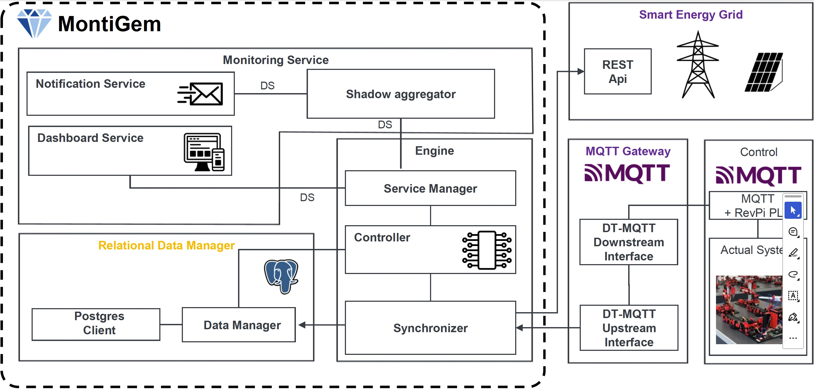

# Monitoring DT



## Architecture

This project implements the architecture shown above as a MontiGem-based
monitoring digital twin for energy availability and consumption.

### MontiGem

- **Monitoring Service**: implemented in the backend as Spring services under
  [`backend/src/main/java/monitoringdt/service`](backend/src/main/java/monitoringdt/service).
  It observes generated MontiGem data streams and updates derived streams and
  notifications.
- **Notification Service**: implemented by
  [`NotificationService`](backend/src/main/java/monitoringdt/service/NotificationService.java).
  It creates an initial startup notification and observes the energy-difference
  stream. When the difference falls below the configured warning or error
  limits, it creates rate-limited notifications in the MontiGem model.
- **Shadow aggregator**: implemented by
  [`ShadowAggregatorService`](backend/src/main/java/monitoringdt/service/ShadowAggregatorService.java).
  It observes available-energy updates and per-machine energy-use streams,
  calculates total factory energy use, and writes the available-minus-used
  energy difference to the `EnergyShadow`.
- **Dashboard Service**: implemented by the MontiGem frontend GUI files under
  [`frontend/src/main/gui`](frontend/src/main/gui). The
  [`VisualizationPage`](frontend/src/main/gui/viz/VisualizationPage.gui) shows
  the function tree, function visualization, available-vs-used energy chart,
  and energy-difference chart. The
  [`Notifications`](frontend/src/main/gui/notifications/Notifications.gui) page
  exposes threshold configuration and notification state.
- **Relational Data Manager**: provided by the generated MontiGem backend and
  configured via
  [`database.properties`](backend/src/main/resources/database.properties). The
  diagram's PostgreSQL client/data-manager responsibilities are represented by
  MontiGem's generated persistence layer.
- **Data Manager**: represented by the generated `MonitoringDTManager` API used
  throughout the backend services. Project-specific services read and write
  generated domain objects such as `EnergyShadow`, `Factory`, `Notification`,
  and `LimitConfiguration` through this manager.
- **Postgres Client**: not implemented as handwritten project code; it is part
  of the MontiGem-generated persistence/runtime infrastructure configured for
  the backend.

### Engine

- **Engine**, **Controller**: The engine is implemented by MontiGem runtime classes(subpackages of `umlp.backendrte`) and generated infrastructure(package `monitoringdt`)
- **Service Manager**: The service manager is implemented via the Spring `@Service` Annotations in backend/src/main/java/monitoringdt/service/ShadowAggregatorService.java  and backend/src/main/java/monitoringdt/service/NotificationService.java
- **Synchronizer**: The synchronizer is implemented via the generated observers(e.g., `monitoringdt.EnergyShadowObserver`), the generated commands (package `monitoringdt.commands`), and the corresponding runtime classes(`umlp.backendrte.command.CommandManager`)

### External Interfaces And Mocks

- **Smart Energy Grid / REST API**: implemented by
  [`smart-energy-grid-mock`](smart-energy-grid-mock). It exposes
  `GET /available-energy` through
  [`AvailableEnergyController`](smart-energy-grid-mock/src/main/java/de/serwth/dt/smartgridmock/AvailableEnergyController.java)
  and returns a simulated available-energy value calculated by
  [`SmartEnergyGridService`](smart-energy-grid-mock/src/main/java/de/serwth/dt/smartgridmock/SmartEnergyGridService.java)
  from baseline energy, a daytime solar curve, deterministic noise, and
  simulated time.
- **Smart Energy Grid polling**: implemented in the backend by
  [`SmartEnergyGridPollingService`](backend/src/main/java/monitoringdt/service/SmartEnergyGridPollingService.java).
  It periodically calls the smart-grid REST endpoint and appends the returned
  available-energy value to `EnergyShadow.availableEnergy`.
- **MQTT Gateway**: represented by the required external MQTT broker, typically
  Mosquitto on `localhost:1883`. The backend connects generated factory MQTT
  bindings to this broker, and the mocks/replay tools exchange events through
  it.
- **DT-MQTT Upstream Interface**: implemented by the backend-generated MQTT
  connector initialized in
  [`MonitoringDTServerApplication`](backend/src/main/java/monitoringdt/MonitoringDTServerApplication.java)
  through `FactoryMqttConnector.connectToMqtt(factory)`. It receives MQTT event
  streams and updates the factory function structure.
- **DT-MQTT Downstream Interface**: no handwritten downstream DT command
  implementation is present in this project; the architecture placeholder is
  represented only by the MQTT broker and generated connector infrastructure.
- **Control / MQTT + RevPi PLC / Actual System**: not implemented as a physical
  control system here. The project uses the included MQTT recording replay
  ([`data/simple_process.csv`](data/simple_process.csv)) to simulate PLC command
  traffic from the Fischertechnik factory.
- **Energy usage mock**: implemented by
  [`energy-usage-mock`](energy-usage-mock). It listens to PLC command and
  command-feedback topics through
  [`EnergyUsageMqttClient`](energy-usage-mock/src/main/java/de/serwth/dt/energyusagemock/EnergyUsageMqttClient.java),
  tracks active operations in
  [`EnergyUsageMockService`](energy-usage-mock/src/main/java/de/serwth/dt/energyusagemock/EnergyUsageMockService.java),
  and publishes mocked per-device `energy_measurement` events back to MQTT for
  drilling, milling, heating, grinding, and polishing.

## Starting the DT

Requirements:
- Java 21
- Mosquitto
- Docker, if you want to run the backend with PostgreSQL

Run every command from the repository root. The DT consists of the MontiGem backend,
the MontiGem frontend, an MQTT input stream, and two local mocks for energy data.
Each long-running command should be started in its own terminal.

### 1. MQTT broker

The backend, the MQTT recording replay, and the energy usage mock expect an MQTT
broker on `localhost:1883`.

For example, with Mosquitto:

```bash
mosquitto -p 1883
```

The broker might be automatically started, in which case the message `Error: Address already in use` will be output.
The DT can then be run without explicitly starting mosquitto.

### 2. Smart energy grid mock

The smart grid mock provides available energy over HTTP. The backend polls this
service at `http://localhost:8090/available-energy` by default.

```bash
./gradlew :smart-energy-grid-mock:bootRun
```

Useful configuration:

| Environment variable | Default | Description |
| --- | --- | --- |
| `PORT` | `8090` | HTTP port |
| `SMART_GRID_BASELINE_WATTS` | `1200` | Static available-energy baseline |
| `SMART_GRID_SOLAR_PEAK_WATTS` | `4500` | Maximum additional solar energy at noon |
| `SMART_GRID_NOISE_WATTS` | `250` | Maximum absolute noise amplitude |
| `SMART_GRID_SPEED_MULTIPLIER` | `60` | Simulated seconds per real second |
| `SMART_GRID_START_TIME` | `2026-06-15T00:00:00` | Simulated timestamp at application startup |
| `SMART_GRID_SEED` | `42` | Deterministic noise seed |

Example:

```bash
SMART_GRID_SPEED_MULTIPLIER=300 ./gradlew :smart-energy-grid-mock:bootRun
```

### 3. Backend

By default, the backend uses the in-memory H2 configuration in
[`backend/src/main/resources/database.properties`](backend/src/main/resources/database.properties).
To run it with PostgreSQL instead, start a local PostgreSQL container before
starting the backend:

```bash
docker run --rm --name monitoring-dt-postgres \
  -e POSTGRES_DB=umlpdb \
  -e POSTGRES_USER=admin \
  -e POSTGRES_PASSWORD=docker \
  -p 5432:5432 \
  postgres:16
```

Then replace the active database configuration with the PostgreSQL variant:

```bash
cp backend/src/main/resources/database-postgres.properties backend/src/main/resources/database.properties
```

Start the MontiGem backend:

```bash
./gradlew :backend:bootRun
```

Defaults:

| Environment variable | Default | Description |
| --- | --- | --- |
| `PORT` | `8081` | Backend HTTP port |
| `CONTEXT_PATH` | `/umlp/api` | Backend API context path |
| `SMART_GRID_POLLING_URL` | `http://localhost:8090/available-energy` | Smart grid endpoint |
| `SMART_GRID_POLLING_INTERVAL_MS` | `5000` | Polling interval |
| `SMART_GRID_POLLING_TIMEOUT_MS` | `2000` | Smart grid request timeout |

### 4. Frontend

Start the MontiGem frontend:

```bash
./gradlew :frontend:run
```

Open the application at:

```text
http://localhost:4200/viz/VisualizationPage
```

Additional pages:

```text
http://localhost:4200/notifications/Notifications
```

### 5. Energy usage mock

The energy usage mock listens to PLC command and command feedback topics from the
recording and publishes mocked device energy measurements back to MQTT.

```bash
./gradlew :energy-usage-mock:run
```

Useful configuration:

| Argument | Environment variable | Default |
| --- | --- | --- |
| `--broker-host` | `ENERGY_USAGE_MOCK_BROKER_HOST` | `localhost` |
| `--broker-port` | `ENERGY_USAGE_MOCK_BROKER_PORT` | `1883` |
| `--client-id` | `ENERGY_USAGE_MOCK_CLIENT_ID` | generated |
| `--publish-interval-ms` | `ENERGY_USAGE_MOCK_PUBLISH_INTERVAL_MS` | `1000` |
| `--publish-timeout-ms` | `ENERGY_USAGE_MOCK_PUBLISH_TIMEOUT_MS` | `2000` |
| `--island` | `ENERGY_USAGE_MOCK_ISLAND` | `Island 1` |

Example:

```bash
./gradlew :energy-usage-mock:run --args='--broker-host=192.168.0.10 --publish-interval-ms=500'
```

### 6. MQTT recording replay

To replay the included recording of the Fischertechnik factory, install
[mqtt-recorder](https://github.com/rpdswtk/mqtt_recorder) and run:

```bash
mqtt-recorder --mode replay --file ./data/simple_process.csv --host localhost
```

### Startup summary

```bash
# terminal 1
mosquitto -p 1883

# optional extra terminal, when using PostgreSQL
docker run --rm --name monitoring-dt-postgres \
  -e POSTGRES_DB=umlpdb \
  -e POSTGRES_USER=admin \
  -e POSTGRES_PASSWORD=docker \
  -p 5432:5432 \
  postgres:16

# terminal 2
./gradlew :smart-energy-grid-mock:bootRun

# terminal 3
./gradlew :backend:bootRun

# terminal 4
./gradlew :frontend:run

# terminal 5
./gradlew :energy-usage-mock:run

# terminal 6
mqtt-recorder --mode replay --file ./data/simple_process.csv --host localhost
```
